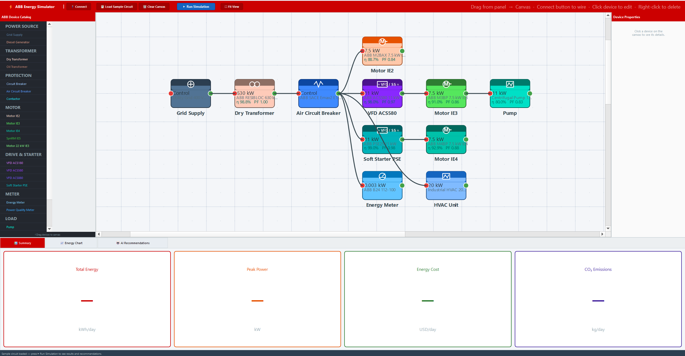
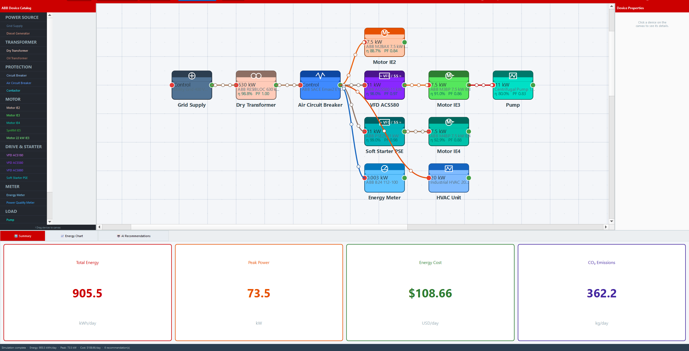

# ABB AI-Powered Electrical Energy Simulator

A PyQt5 desktop application for visually designing industrial electrical circuits using ABB's real product portfolio, simulating 24-hour energy consumption, and receiving AI-generated energy-saving recommendations.

---

### Main Interface



### Energy Summary & Statistics



---

## Features

- **Interactive Circuit Editor** — Drag-and-drop ABB devices onto a canvas and connect them with animated Bézier wires
- **24-Hour Simulation** — Physics-based engine models motors, drives, transformers, and loads with realistic load profiles
- **AI Recommendations** — Rule-based engine analyzes your circuit and suggests upgrades (VFDs, motor efficiency tiers, power factor correction, etc.) with estimated savings and ROI
- **Energy Metrics** — Summary cards for total energy (kWh), cost (USD), CO₂ emissions (kg), and peak demand (kW)
- **Embedded Charts** — 24-hour power profile and per-device energy breakdown via matplotlib
- **Factory Template** — Pre-built 13-device industrial circuit to explore all features instantly

## Device Catalog

~25 real ABB products across 7 categories:

| Category | Example Devices |
|---|---|
| Source | Grid Supply |
| Transformer | RESIBLOC |
| Protection | Tmax T4, Emax2 E2 |
| Motor | M2BAX IE2, M3BP IE3, M4BP IE4, SynRM IE5 |
| Drive | ACS180, ACS580, ACS880, PSE soft starter |
| Meter | B24, M4M |
| Load | Pump, Compressor, HVAC, LED Lighting, Conveyor |

## Getting Started

### Prerequisites

Python 3.8+

### Installation

```bash
pip install -r requirements.txt
```

### Run

```bash
# Main application (blank canvas)
python main.py

# Pre-built factory template
python template.py
```

Dependencies are also auto-installed on first launch via `main.py`.

## Usage

1. **Add devices** — Drag items from the left palette onto the canvas
2. **Connect devices** — Click **Connect** in the toolbar, then click a source port followed by a destination port
3. **Configure** — Select a device and adjust **Load Factor** and **Operating Hours** in the right panel
4. **Simulate** — Click **Run Simulation** to compute energy metrics
5. **Review** — Check the Results panel for the energy chart and AI recommendations

## Project Structure

```
main.py             # Entry point
main_window.py      # Main UI window and panels
canvas.py           # Interactive circuit diagram editor
devices.py          # ABB device catalog and data model
simulation.py       # 24-hour physics-based simulation engine
recommendations.py  # AI recommendation engine
template.py         # Pre-built factory circuit template
requirements.txt    # Python dependencies
```

## Requirements

```
PyQt5>=5.15.0
matplotlib>=3.4.0
numpy>=1.20.0
```

